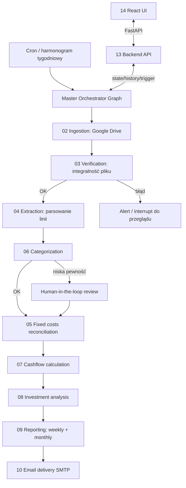

# 00 — Overview & Architecture

## Cel

AI Finance Agent automatyzuje cotygodniowy proces analizy finansów prywatnych:
odbiera wyciągi bankowe wgrywane na Dysk Google, weryfikuje ich
poprawność, wyciąga z nich pozycje transakcyjne, kategoryzuje je, wylicza
bilans (przychody/wydatki/nadwyżka), proponuje alokację nadwyżki na
inwestycje i wysyła raport (tygodniowy oraz miesięczny) na maila. Całość ma
działać bez interakcji użytkownika poza wyjątkami wymagającymi jego decyzji
(niska pewność kategoryzacji, błąd w wyciągu).

## Aktorzy i źródła danych

- **Konto prywatne** — jedyne śledzone konto (patrz [[01-spec-data-model]]).
  Wpływy z konta firmowego trafiają na prywatne jako zwykły przelew, więc
  konto firmowe nie jest częścią tego systemu.
- **Dysk Google** — jedyne źródło wejściowe wyciągów, wgrywanych ręcznie co
  tydzień przez użytkownika do jednego folderu, którego ID konfiguruje się w
  `.env` (patrz [[02-spec-google-drive-ingestion]]).
- **Tabela kosztów stałych** — dostarczona przez użytkownika później, patrz
  [[05-spec-fixed-costs]].
- **Tabela kategorii** — dostarczona przez użytkownika później, patrz
  [[01-spec-data-model]] i [[06-spec-categorization]].
- **Odbiorca raportów** — mail(e) do ustalenia, patrz
  [[10-spec-email-delivery]].

## Wybór frameworka: LangGraph

Proces jest deterministycznym, rozgałęzionym pipeline'em z punktami
przerwania na decyzję człowieka (human-in-the-loop) i wymaga trwałego stanu
między uruchomieniami (co tydzień nowy wsad). To pasuje do **LangGraph**
(`StateGraph`), nie do prostego agenta LangChain (zbyt złożony przepływ jak
na pojedynczy tool-loop) ani do Deep Agents (nie potrzebujemy dynamicznego
planowania/subagentów ad-hoc — kroki są znane z góry).

Zasada z projektowego `CLAUDE.md`: **żadnego LangGraph Studio ani
LangSmith** do wizualizacji/obserwowalności (wymagają logowania do konta
zewnętrznego). Zamiast tego:
- struktura grafu: `graph.get_graph().draw_mermaid()` renderowane w React UI,
- historia wykonań: lokalny checkpointer + `graph.get_state_history()`,
- wszystko wystawione przez lokalny FastAPI backend, patrz
  [[13-spec-backend-api]] i [[14-spec-frontend-ui]].

## Architektura wysokopoziomowa

Master graph = orkiestrator, każdy etap poniżej to subgraph (własny
checkpointer scope, patrz `langgraph-persistence`):

Orkiestracja i harmonogram (kiedy odpalać tygodniowy vs. miesięczny raport,
`thread_id` per okres) opisane w [[11-spec-orchestration-scheduling]].

## Stos technologiczny (ustalony)

| Warstwa | Wybór | Uwagi |
|---|---|---|
| Backend / logika agenta | Python | ustalone w `CLAUDE.md` |
| Orkiestracja | LangGraph | patrz wyżej |
| UI | React | ustalone w `CLAUDE.md` |
| API pośredniczące | FastAPI | patrz [[13-spec-backend-api]] |
| LLM | OVH AI Endpoints (serverless, OpenAI-compatible) | patrz [[12-spec-llm-integration-ollama]] |
| Baza danych | PostgreSQL (lokalnie i w każdym środowisku deployu) | patrz [[01-spec-data-model]] |
| Wysyłka maili | SMTP | patrz [[10-spec-email-delivery]] |
| Format wyciągów | PDF | patrz [[04-spec-transaction-extraction]] |
| Deploy | Docker + Coolify (już dostępny) | patrz [[15-spec-deployment-coolify]] |

## Mapa specyfikacji

| # | Plik | Zakres |
|---|---|---|
| 00 | overview-architecture | ten dokument |
| 01 | data-model | schemat bazy danych |
| 02 | google-drive-ingestion | pobieranie nowych wyciągów |
| 03 | statement-verification | walidacja poprawności wyciągu |
| 04 | transaction-extraction | parsowanie linii z PDF |
| 05 | fixed-costs | koszty stałe i dopasowanie |
| 06 | categorization | przypisanie kategorii do transakcji |
| 07 | cashflow-calculation | bilans przychodów/wydatków |
| 08 | investment-analysis | propozycja alokacji nadwyżki |
| 09 | reporting | treść raportu tygodniowego/miesięcznego |
| 10 | email-delivery | wysyłka SMTP |
| 11 | orchestration-scheduling | master graph + harmonogram |
| 12 | llm-integration-ollama | integracja z OVH AI Endpoints |
| 13 | backend-api | FastAPI dla UI |
| 14 | frontend-ui | React UI |
| 15 | deployment-coolify | topologia Docker/Coolify |
| 16 | testing-strategy | strategia testów |

## Zdecydowane

- Realna zawartość tabeli kategorii i kosztów stałych — repo jest publiczne,
  więc te dane żyją wyłącznie w gitignored `data/local/*.json`, nie w
  repozytorium; patrz
  [[01-spec-data-model#przechowywanie-realnej-zawartości-categories-i-fixed_costs]].
- Autoryzacja serwerowa do Google Drive: OAuth kontem osobistym użytkownika
  (nie service account) — patrz [[02-spec-google-drive-ingestion]].

## Otwarte kwestie (globalne, nie do zgadnięcia)

- Profil ryzyka i instrumenty inwestycyjne — patrz
  [[08-spec-investment-analysis]].

## Kryteria akceptacji

- Każdy subgraph z diagramu ma odpowiadającą specyfikację z jasnym
  wejściem/wyjściem.
- Diagram grafu renderowany w UI odpowiada rzeczywistej strukturze
  `master_graph.get_graph().draw_mermaid()` (weryfikowalne dopiero po
  implementacji [[11-spec-orchestration-scheduling]]).
