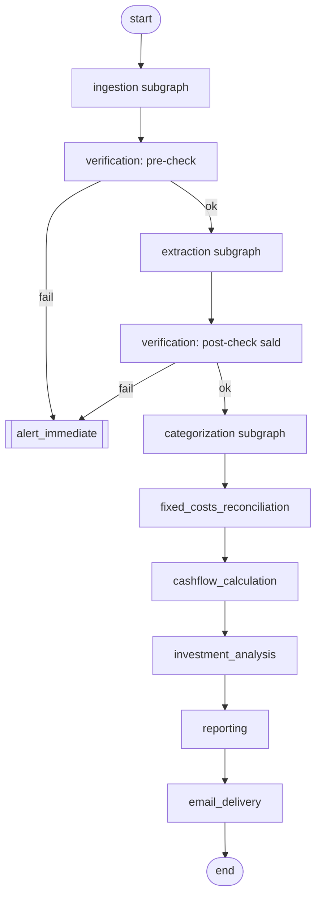

# 11 — Orchestration & Scheduling

## Cel

Spiąć wszystkie subworkflowy (02–10) w jeden master graph LangGraph,
zdefiniować harmonogram uruchomień (tygodniowy trigger, warunkowy raport
miesięczny) i trwałość stanu między uruchomieniami.

## Zakres

Wchodzi: struktura master grafu, `thread_id` per konto/okres, checkpointer,
logika wyzwalania. Nie wchodzi: logika wewnętrzna poszczególnych
subworkflowów (patrz odpowiednie specyfikacje 02–10).

## Master graph

**Korekta (Plan A krok 12, na podstawie realnej implementacji z kroku 6):**
wcześniejszy szkic tego diagramu rysował `HITL{{interrupt: human review}}`
jako osobny węzeł master grafu z rozgałęzieniem po `needs_review` — zanim
`categorization` istniał w pełnym szczególe. Realny subgraph (krok 6)
trzyma przegląd człowieka **wewnątrz siebie**
(`rule_match → llm_classify → confidence_gate → human_review → persist_category`,
z `interrupt()` w `human_review`) — dokładnie tak samo jak `CAT` jest tu
jednym boxem mimo wielu wewnętrznych węzłów, identycznie jak
`fixed_costs_reconciliation`/`cashflow_calculation`/inne. Krawędź
`CAT → FIX` jest więc bezwarunkowa: transakcje pozostawione `needs_review`
po ewentualnym `interrupt()`/wznowieniu i tak wchodzą dalej (krok 8 już
zdecydował, że wliczają się do bilansu z ostrzeżeniem, nie blokują
pipeline'u) — to też odpowiada na starą otwartą kwestię „zachowanie przy
błędzie w trakcie długiego human_review": nie ma osobnego zachowania do
zdefiniowania, bo pipeline i tak nie czeka.

**Jak `categorization` jest naprawdę podpięty** (zweryfikowane bezpośrednio
w dokumentacji/źródłach LangGraph, nie zgadywane): `CategorizationState`
nie ma wspólnych pól z `MasterGraphState`, więc nie może być zamontowany
przez dosłowne `builder.add_node(nazwa, skompilowany_subgraph)` (LangGraph
scala tylko nakładające się klucze state'u). Zamiast tego `_categorization_node`
(`graph/master.py`) to zwykła funkcja-węzeł, która sama otwiera sesję i
wywołuje `build_categorization_graph(...).ainvoke(...)` — dokładnie ten sam
wzorzec co każdy inny subgraph tutaj (`fixed_costs_reconciliation`,
`cashflow_calculation` itd.). Kluczowy, zweryfikowany fakt: `interrupt()`
wywołane głęboko wewnątrz w ten sposób i tak poprawnie zatrzymuje **cały**
master graf, wznawialny przez `Command(resume=...)` na `thread_id` master
grafu — pod warunkiem, że `categorization`'s subgraph jest skompilowany
**bez własnego** checkpointera (dziedziczy checkpointer aktywnego
przebiegu). Pozostałe subgrafy (02–05, 07–10) używają tego samego wzorca
funkcja-węzeł, ale bez tej złożoności — nie potrzebują `interrupt()`, więc
kwestia dziedziczenia checkpointera ich nie dotyczy.

## Harmonogram

- **Trigger tygodniowy** — cron (np. `langgraph-cli`/scheduler zewnętrzny
  albo cron Coolify wywołujący endpoint FastAPI, patrz
  [[13-spec-backend-api]]) uruchamiający master graph raz w tygodniu —
  zawsze dokładnie jeden run (jedno śledzone konto, patrz
  [[01-spec-data-model]]).
- **Raport miesięczny** — nie osobny trigger, lecz warunek wewnątrz węzła
  `reporting`: jeśli data uruchomienia przypada na pierwszy przebieg po
  końcu miesiąca kalendarzowego → dodatkowo wygeneruj raport miesięczny
  (patrz [[09-spec-reporting]] `determine_report_types`).
- **`thread_id`** — jeden wątek per tydzień, umożliwiający
  `get_state_history` i time-travel dla debugowania konkretnego
  uruchomienia (patrz [[13-spec-backend-api]] dla wystawienia tego w UI).
  Zrobione: `generate_weekly_thread_id()` (`graph/runner.py`) —
  `f"run-{iso_rok}-W{iso_tydzień:02d}"`, ISO tydzień kalendarzowy.

## Checkpointer

PostgreSQL (`langgraph-checkpoint-postgres`), spójne z ustaloną bazą danych
w [[01-spec-data-model]] — jeden silnik bazy dla danych domenowych i stanu
grafu, prostszy deploy w Coolify. Zrobione: `graph/checkpointer.py` —
`build_checkpointer(settings)` zwraca `AsyncPostgresSaver.from_conn_string(...)`
(async context manager), `psycopg_dsn_from_database_url` transformuje
`DATABASE_URL` (`postgresql+asyncpg://...`, SQLAlchemy) na zwykły DSN
(`postgresql://...`) — psycopg (v3, sterownik checkpointera, obok już
istniejącego `asyncpg`) nie zna dialektu `+asyncpg`. **Wymaga
`psycopg[binary]`, nie gołego `psycopg`** — zweryfikowane bezpośrednio: bez
`binary` import failuje na tej maszynie deweloperskiej brakiem systemowego
`libpq` (`ImportError: no pq wrapper available`). Tabele tworzone raz,
ręcznie: `scripts/setup_checkpointer.py` (mirror
`scripts/seed_reference_data.py`), nigdy przy starcie aplikacji.

**Windows-specific, zweryfikowane bezpośrednio:** `psycopg`'s tryb async
nie działa z domyślnym `ProactorEventLoop`
(`psycopg.InterfaceError: Psycopg cannot use the 'ProactorEventLoop'`) —
`scripts/setup_checkpointer.py` i `tests/conftest.py` przełączają na
`WindowsSelectorEventLoopPolicy` (bezpieczne też dla `asyncpg`, używanego
wszędzie indziej). Prawdopodobnie nieistotne na docelowym środowisku
wdrożeniowym (Linux, patrz [[15-spec-deployment-coolify]]), ale konieczne
lokalnie na tej maszynie.

**Wywołanie/wznowienie** (`graph/runner.py`): `run_master_graph(thread_id,
resume=...)` otwiera `build_checkpointer()` (fresh, per-call — nic nie
zostaje otwarte przez czas trwania ewentualnej przerwy na przegląd
człowieka), buduje master graf z tym checkpointerem, `ainvoke`'uje stan
startowy lub `Command(resume=...)`. To jest "logika wyzwalania" z zakresu
tej specyfikacji — sama wystawka przez HTTP to [[13-spec-backend-api]].

## Zależności

Zależy od wszystkich subworkflowów 02–10. Konsumowane przez
[[13-spec-backend-api]] (trigger ręczny, podgląd historii) i
[[15-spec-deployment-coolify]] (harmonogram jako zadanie cron w
środowisku wdrożeniowym).

## Otwarte kwestie

- Mechanizm cron: harmonogram wewnątrz aplikacji (np. APScheduler w
  procesie FastAPI) vs. zewnętrzny cron Coolify uderzający w endpoint — do
  ustalenia przy [[15-spec-deployment-coolify]]. `run_master_graph`
  (`graph/runner.py`) jest gotowy do wywołania przez którykolwiek mechanizm
  wybrany tam.
- ~~Zachowanie przy błędzie w trakcie długiego `human_review`...~~ —
  rozstrzygnięte przy realnym podpięciu (patrz korekta w „Master graph"
  wyżej): nie ma osobnego zachowania do zdefiniowania, bo `CAT → FIX` jest
  bezwarunkowa — pipeline nigdy nie czeka na przegląd, niezależnie jak
  długo się przeciąga.

## Kryteria akceptacji / testy

- ~~Test end-to-end... pełny przebieg od ingestion do email_delivery~~ —
  **świadomie poza zakresem krokowej implementacji**: każdy subgraph ma już
  własne dedykowane testy z fake'ami na swoim poziomie
  (`test_ingestion_graph.py`, `test_extraction_graph.py` itd.); pełna
  mega-integracja wymagałaby realnych bajtów PDF, których repo świadomie
  unika ([[16-spec-testing-strategy]]).
- Test `get_state_history`/`aget_state_history` zwraca kompletną historię
  kroków dla danego `thread_id` — zrobione w
  `tests/test_master_graph_categorization.py` (na syntetycznym grafie,
  patrz niżej).
- Test przerwania i wznowienia (`interrupt()` → `Command(resume=...)`) nie
  gubi stanu zebranego przed przerwaniem — zrobione, ale **na syntetycznym
  grafie** (`tests/test_master_graph_categorization.py`), nie na realnym
  `_categorization_node`: ten zawsze otwiera sesję przez
  `async_session_factory`, sztywno wpięty w `DATABASE_URL` (baza
  deweloperska, tak samo jak każdy inny realny węzeł master grafu) — nie
  ma jeszcze DI wskazującego na `TEST_DATABASE_URL`. Prawdziwa logika
  kategoryzacji (`rule_match`/`llm_classify`/`confidence_gate`/
  `human_review`/`persist_category`) jest już dokładnie przetestowana na
  realnej bazie testowej w [[06-spec-categorization]]
  (`tests/test_categorization_graph.py`) — to, co wymagało weryfikacji
  tutaj, to wyłącznie sam mechanizm zagnieżdżenia (czy `interrupt()`
  wywołane w subgraphu bez `add_node` faktycznie zatrzymuje graf
  zewnętrzny), nie logika biznesowa. Pełne testowanie integracyjne z realną
  bazą stanie się możliwe wraz z [[13-spec-backend-api]], które i tak
  potrzebuje DI sesji per-request.
- Test logiki „koniec miesiąca" na granicznych datach — zrobione w kroku 10
  (`tests/test_reporting_graph.py`), nie tutaj (ta logika żyje w
  `determine_report_types`, [[09-spec-reporting]]).
