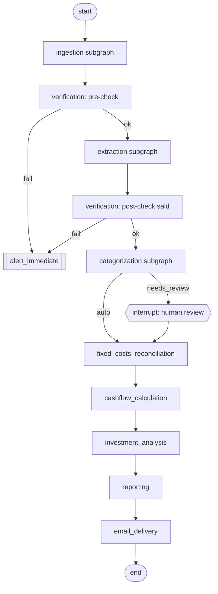

# 11 — Orchestration & Scheduling

## Cel

Spiąć wszystkie subworkflowy (02–10) w jeden master graph LangGraph,
zdefiniować harmonogram uruchomień (tygodniowy trigger, warunkowy raport
miesięczny) i trwałość stanu między uruchomieniami.

## Zakres

Wchodzi: struktura master grafu, `thread_id` per konto/okres, checkpointer,
logika wyzwalania. Nie wchodzi: logika wewnętrzna poszczególnych
subworkflowów (patrz odpowiednie specyfikacje 02–10).

## Master graph

Każdy subgraph (02–10) jest zaimplementowany jako oddzielny `StateGraph`
skomponowany w node'a master grafu (subgraph pattern), z własnym scope
checkpointera zgodnie z `langgraph-persistence`.

## Harmonogram

- **Trigger tygodniowy** — cron (np. `langgraph-cli`/scheduler zewnętrzny
  albo cron Coolify wywołujący endpoint FastAPI, patrz
  [[13-spec-backend-api]]) uruchamiający master graph raz w tygodniu, osobno
  dla `account_type = private` i `account_type = company` (albo jeden run
  obsługujący oba, do ustalenia).
- **Raport miesięczny** — nie osobny trigger, lecz warunek wewnątrz węzła
  `reporting`: jeśli data uruchomienia przypada na pierwszy przebieg po
  końcu miesiąca kalendarzowego → dodatkowo wygeneruj raport miesięczny
  (patrz [[09-spec-reporting]] `determine_report_types`).
- **`thread_id`** — jeden wątek per `(account_id, tydzień)`, umożliwiający
  `get_state_history` i time-travel dla debugowania konkretnego
  uruchomienia (patrz [[13-spec-backend-api]] dla wystawienia tego w UI).

## Checkpointer

PostgreSQL (`langgraph-checkpoint-postgres`), spójne z ustaloną bazą danych
w [[01-spec-data-model]] — jeden silnik bazy dla danych domenowych i stanu
grafu, prostszy deploy w Coolify.

## Zależności

Zależy od wszystkich subworkflowów 02–10. Konsumowane przez
[[13-spec-backend-api]] (trigger ręczny, podgląd historii) i
[[15-spec-deployment-coolify]] (harmonogram jako zadanie cron w
środowisku wdrożeniowym).

## Otwarte kwestie

- Mechanizm cron: harmonogram wewnątrz aplikacji (np. APScheduler w
  procesie FastAPI) vs. zewnętrzny cron Coolify uderzający w endpoint — do
  ustalenia przy [[15-spec-deployment-coolify]].
- Czy konto prywatne i firmowe są przetwarzane w jednym uruchomieniu grafu
  (dwie gałęzie równoległe), czy w dwóch niezależnych runach z osobnymi
  `thread_id` — wpływa na strukturę master grafu (`Send` API do
  równoległego fan-out per konto, patrz `langgraph-fundamentals`).
- Zachowanie przy błędzie w trakcie długiego `human_review` (co jeśli
  przegląd nie zostanie potwierdzony przed terminem raportu tygodniowego) —
  do ustalenia: raport z ostrzeżeniem o niekompletnych danych vs. opóźnienie
  wysyłki.

## Kryteria akceptacji / testy

- Test end-to-end na fixture'ach: pełny przebieg od `ingestion` do
  `email_delivery` bez rzeczywistego Drive/SMTP (mocki/fixture'y zgodnie z
  [[16-spec-testing-strategy]]).
- Test `get_state_history` zwraca kompletną historię kroków dla danego
  `thread_id`.
- Test przerwania i wznowienia (`interrupt()` → `Command(resume=...)`) nie
  gubi stanu zebranego przed przerwaniem.
- Test logiki „koniec miesiąca” na granicznych datach (ostatni dzień
  miesiąca, przejście roku).
