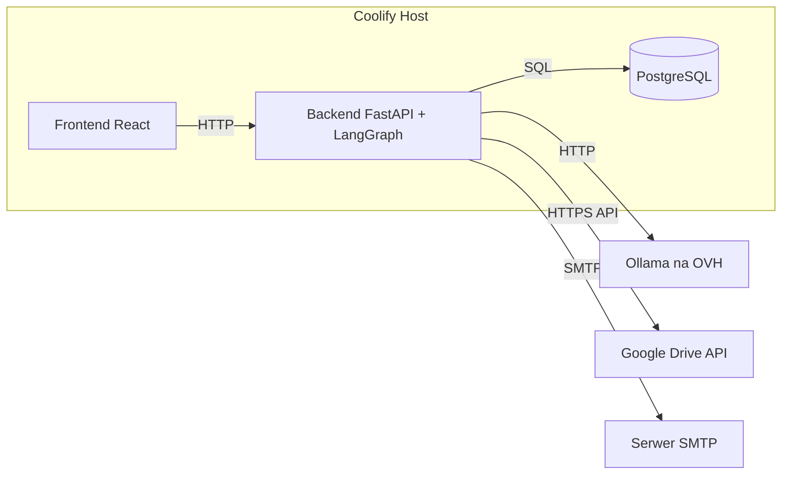

# 15 — Deployment (Docker / Coolify)

## Cel

Zdefiniować topologię wdrożenia całego systemu na istniejącej instalacji
Coolify, z wykorzystaniem Docker.

## Zakres

Wchodzi: serwisy, wolumeny, zmienne środowiskowe, harmonogram cron. Nie
wchodzi: kod aplikacyjny poszczególnych serwisów (patrz odpowiednie specs).

## Serwisy (projekt wstępny)

- **Backend** — kontener Python/FastAPI, zawiera master graph LangGraph,
  wystawia API z [[13-spec-backend-api]], odpowiada też za cron
  (harmonogram tygodniowy, patrz [[11-spec-orchestration-scheduling]]).
- **Frontend** — kontener React (build statyczny serwowany np. przez Nginx
  lub Next.js server, do ustalenia przy `init-frontend`).
- **PostgreSQL** — dane domenowe + checkpointer LangGraph (patrz
  [[01-spec-data-model]]).
- **Brak wolumenu na PDF-y** — pobrane wyciągi nie są trwale
  przechowywane; Drive jest jedynym źródłem prawdy, pliki pobierane
  on-demand po `drive_file_id` (patrz [[02-spec-google-drive-ingestion]]).
- **Ollama (OVH)** — zewnętrzny, nie hostowany w tym samym Coolify
  (potwierdzone przez użytkownika: „na dysku OVH są ollamy”) — backend
  łączy się przez sieć do endpointu OVH.

## Zmienne środowiskowe / sekrety (nazwy, nigdy wartości)

| Zmienna | Cel |
|---|---|
| `DATABASE_URL` | connection string PostgreSQL |
| `SMTP_HOST`, `SMTP_PORT`, `SMTP_USER`, `SMTP_PASSWORD` | wysyłka raportów, patrz [[10-spec-email-delivery]] |
| `GOOGLE_OAUTH_CLIENT_ID`, `GOOGLE_OAUTH_CLIENT_SECRET`, `GOOGLE_OAUTH_REFRESH_TOKEN`, `GOOGLE_DRIVE_FOLDER_ID` | autoryzacja OAuth do Drive kontem osobistym + folder z wyciągami, patrz [[02-spec-google-drive-ingestion]] |
| `OLLAMA_BASE_URL`, `OLLAMA_MODEL_CLASSIFICATION`, `OLLAMA_MODEL_INVESTMENT`, `OLLAMA_MODEL_REPORTING`, `OLLAMA_API_KEY` | endpoint i modele OVH, patrz [[12-spec-llm-integration-ollama]] |
| `REPORT_RECIPIENT_EMAIL` | odbiorca raportów, patrz [[10-spec-email-delivery]] |

Zgodnie z `CLAUDE.md`: wartości wyłącznie w `.env` / sekretach Coolify,
nigdy w kodzie, commitach czy tej dokumentacji.

## Harmonogram

Cron zdefiniowany w Coolify (scheduled task) wywołujący `POST /runs` na
backendzie raz w tygodniu — spójne z decyzją w
[[11-spec-orchestration-scheduling]] (alternatywa: harmonogram wewnętrzny w
aplikacji, do ostatecznego wyboru przy implementacji).

## Zależności

Zależy od wszystkich pozostałych specyfikacji jako konsument finalnego
kodu każdego serwisu.

## Otwarte kwestie

- Czy PostgreSQL ma być osobnym serwisem Coolify, czy współdzielonym z
  innymi projektami na tym samym hoście (izolacja danych finansowych sugeruje
  dedykowaną instancję) — do potwierdzenia.
- Mechanizm crona: natywny scheduler Coolify vs. wbudowany w aplikację
  (APScheduler) — powiązane z otwartą kwestią w
  [[11-spec-orchestration-scheduling]].
- Strategia backupu bazy danych (dane finansowe — utrata = utrata historii
  transakcji) — do zaprojektowania (np. cykliczny `pg_dump` do
  osobnego storage).
- Sieciowe połączenie do Ollama na OVH: publiczny endpoint z
  uwierzytelnieniem vs. VPN/prywatna sieć — wpływa na `OLLAMA_BASE_URL` i
  ewentualny dodatkowy sekret.

## Kryteria akceptacji / testy

- `docker compose up` (lub odpowiednik Coolify) lokalnie odtwarza pełne
  środowisko (backend, frontend, DB) bez błędów.
- Health-check wszystkich serwisów (`/health` z [[13-spec-backend-api]])
  zielony po starcie.
- Test disaster-recovery: restart kontenera backendu nie gubi stanu grafu
  (checkpointer w Postgres przeżywa restart) — pobrane pliki nie wymagają
  osobnej ochrony, bo nie są trwale przechowywane poza Drive.
